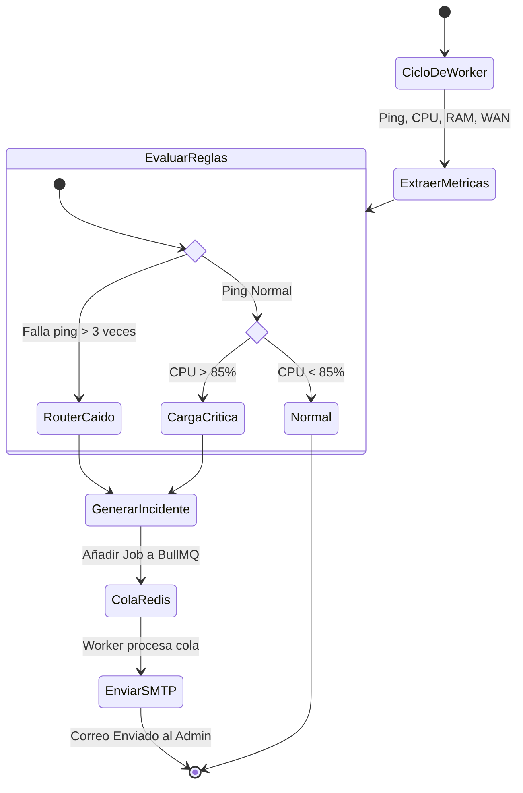

# Motor de Alertas (Alert Engine)

El Worker no solo guarda históricos, sino que monitorea condiciones y evalúa de manera constante si el estado del enrutador es anómalo para emitir notificaciones proactivas.

## Diagrama de Actividades (UML)

Este diagrama representa el árbol de decisiones que toma el motor de alertas (Alert Engine) en cada ciclo del Worker.

## Cola de Correos (BullMQ)

El paso de `GenerarIncidente` a `ColaRedis` es crucial. Si el servidor SMTP (ej. Gmail) demora en responder o deniega temporalmente el inicio de sesión, la cola en **Redis** (gestionada por BullMQ) asegura que la alerta no se pierda en la memoria volatil. El sistema reintentará su envío de forma automática con retroceso exponencial (Exponential Backoff).
