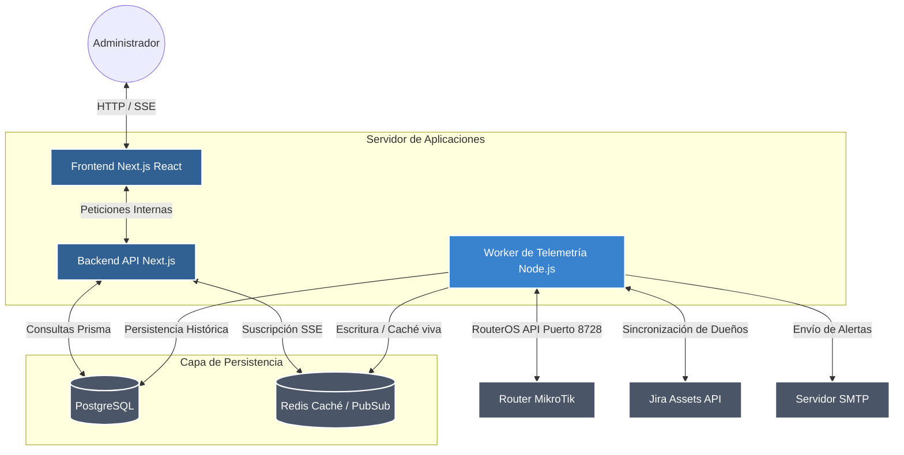
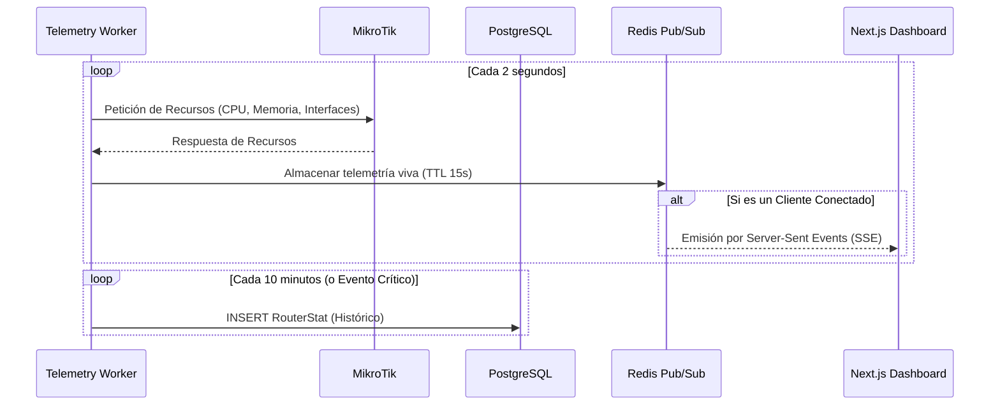

# Arquitectura del Sistema

El proyecto **REN MikroTik Monitor** sigue una arquitectura distribuida que separa claramente la presentación, la base de datos y la recolección de métricas.

## Diagrama de Componentes (UML)

A continuación se muestra el diagrama de arquitectura general del sistema:

## Secuencia de Telemetría (UML)

Este diagrama muestra cómo interactúa el Worker para recolectar datos y mostrarlos en tiempo real en la pantalla del administrador:

## Decisiones Técnicas

- **Separación de Responsabilidades**: El recolector de datos (worker) corre de forma asíncrona mediante `concurrently` o en un contenedor separado. Esto asegura que si la API del router se retrasa, no afecta el rendimiento del entorno web de Next.js.
- **Server-Sent Events (SSE)**: En vez de hacer polling constante desde el navegador a la base de datos (lo que sobrecargaría PostgreSQL), Next.js consume los datos en caché desde Redis y los transmite vía SSE a la UI.
