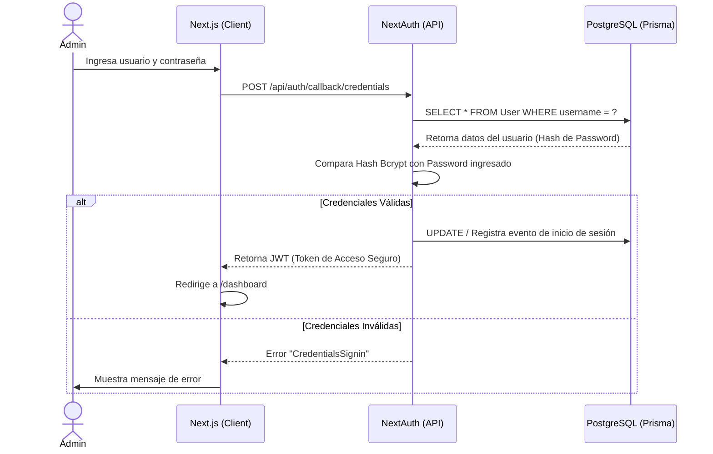

# Autenticación y Seguridad (NextAuth)

El sistema de autenticación de **REN MikroTik Monitor** se basa en **NextAuth.js (v5)** para proveer seguridad y manejo de sesiones de forma robusta.

## Diagrama de Secuencia de Autenticación (UML)

A continuación, se detalla el proceso completo desde que el administrador intenta iniciar sesión hasta que obtiene acceso al panel:

## Middleware de Protección

El sistema utiliza el Middleware perimetral de Next.js (`middleware.ts`). Este middleware intercepta todas las peticiones a rutas protegidas (como `/dashboard`, `/inventory` o cualquier endpoint bajo `/api/`) y valida la existencia y vigencia del JWT antes de permitir que la petición llegue al servidor.
