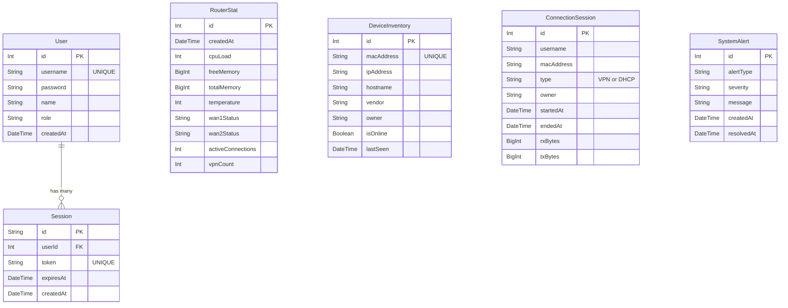

# Estructura de la Base de Datos

El sistema utiliza **PostgreSQL** administrado mediante **Prisma ORM**. La base de datos está diseñada para soportar consultas analíticas sobre históricos de métricas y gestión de inventario de dispositivos.

## Diagrama de Entidad Relación (UML ERD)

## Descripción de Modelos Core

*   **User & Session**: Manejo del panel de acceso (NextAuth). Contiene roles y los tokens de sesión.
*   **RouterStat**: El historial de telemetría del router. Se crea una nueva fila cada 10 minutos (por defecto) o inmediatamente si ocurre un evento crítico (CPU > 85%, ping muy alto).
*   **DeviceInventory**: Registra cada dispositivo único (por Dirección MAC) visto en la red.
*   **ConnectionSession**: Audita los tiempos de sesión exacta de un usuario. Por ejemplo, al conectarse a la VPN se abre un registro; cuando el worker detecta que la sesión terminó, marca el `endedAt` y calcula los bytes traficados totales.
