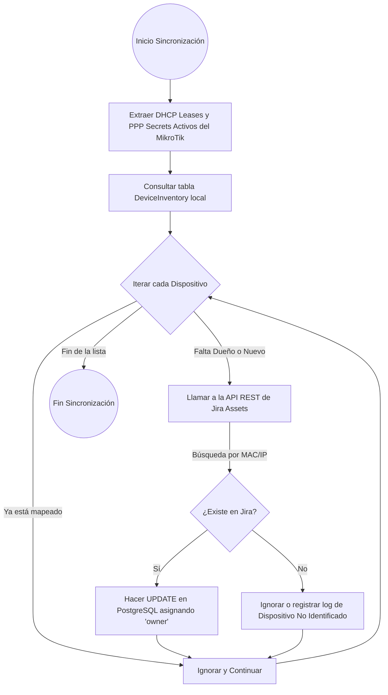

# Integración con Jira Assets

El sistema cuenta con una integración nativa para sincronizar los dispositivos conectados al router (MikroTik) con la base de datos de inventario y empleados administrada en **Jira Service Management (Assets)**.

## Flujograma de Sincronización (UML)

Este diagrama ilustra la lógica que sigue el Worker de telemetría para auditar las conexiones (VPN/DHCP) y cruzar esa información con Jira.

## Configuración Requerida

Para que este proceso (Flowchart) se ejecute correctamente, el archivo `.env` debe incluir las variables de entorno relacionadas con Atlassian:
- `JIRA_EMAIL`
- `JIRA_API_TOKEN`
- `JIRA_WORKSPACE_ID`
