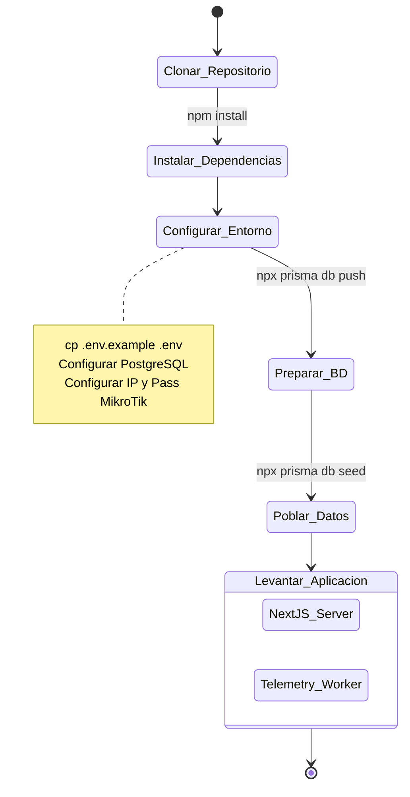

# Guía de Configuración y Despliegue

La puesta en marcha del proyecto involucra preparar la base de datos, configurar las integraciones (MikroTik, Jira, SMTP) y levantar el servidor de Node.js.

## Diagrama de Flujo de Despliegue (UML)



## Prerrequisitos de Infraestructura

Para garantizar el funcionamiento óptimo de este monitor en producción, se recomienda:

1. **Base de Datos**: PostgreSQL >= 13.
2. **Caché/Colas**: Redis (necesario para el módulo de reintentos de colas de correos y para emitir eventos en vivo sin tocar la BD).
3. **Router**: MikroTik corriendo RouterOS con el servicio de `api` (puerto 8728) o `api-ssl` habilitado en `IP > Services`.

## Compilación para Producción

Si deseas ejecutar la aplicación en un servidor productivo (en lugar del entorno de desarrollo que utiliza `npm run dev`), deberás compilar la aplicación de Next.js:

```bash
# 1. Compilar Next.js
npm run build

# 2. Iniciar en modo producción
npm run start

# 3. En una ventana o proceso paralelo, correr el recolector de métricas
npm run worker
```

**Nota para Producción**: Se recomienda utilizar un gestor de procesos como `PM2` o correr la plataforma en contenedores **Docker** para garantizar que tanto la web de Next.js como el archivo `worker/telemetry.ts` se reinicien automáticamente en caso de fallos.
