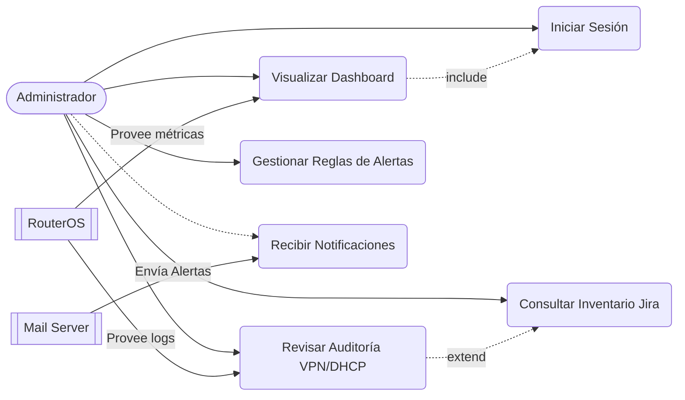

# Casos de Uso del Sistema

La siguiente documentación describe las acciones e interacciones permitidas para el perfil de Administrador dentro del ecosistema de monitorización.

## Diagrama de Casos de Uso (UML adaptado)

*Nota: Dado que Mermaid no soporta diagramas de casos de uso de forma nativa en GitHub, este diagrama se modela utilizando un Flowchart direccional.*

## Detalles de los Casos de Uso Principales

1. **Visualizar Dashboard**: El administrador puede observar en gráficas de react-chartjs la evolución de la memoria, CPU y red (RX/TX).
2. **Consultar Inventario**: Ver qué empleados (nombres sincronizados desde Jira) están consumiendo ancho de banda.
3. **Revisar Auditoría**: Ver históricos de conexión (cuánto tiempo estuvo activa una VPN y cuántos megabytes descargó).
